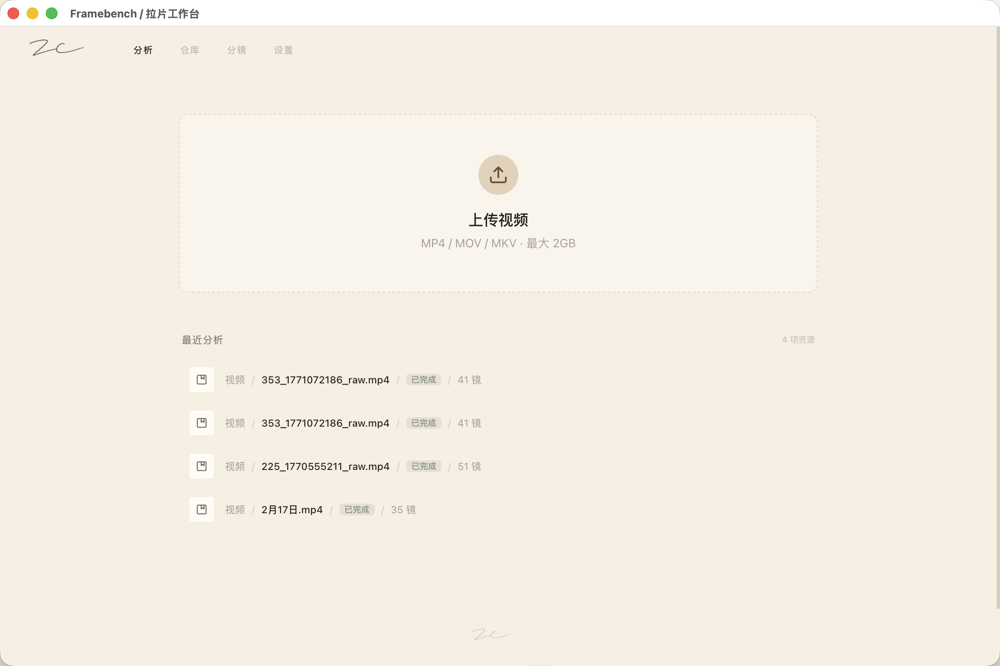
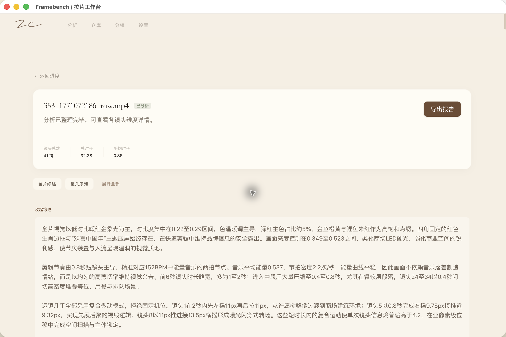
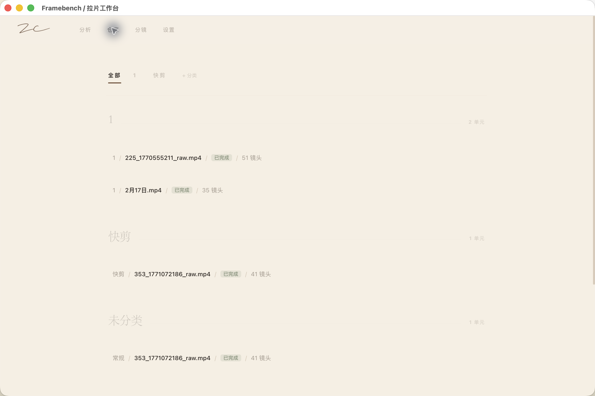
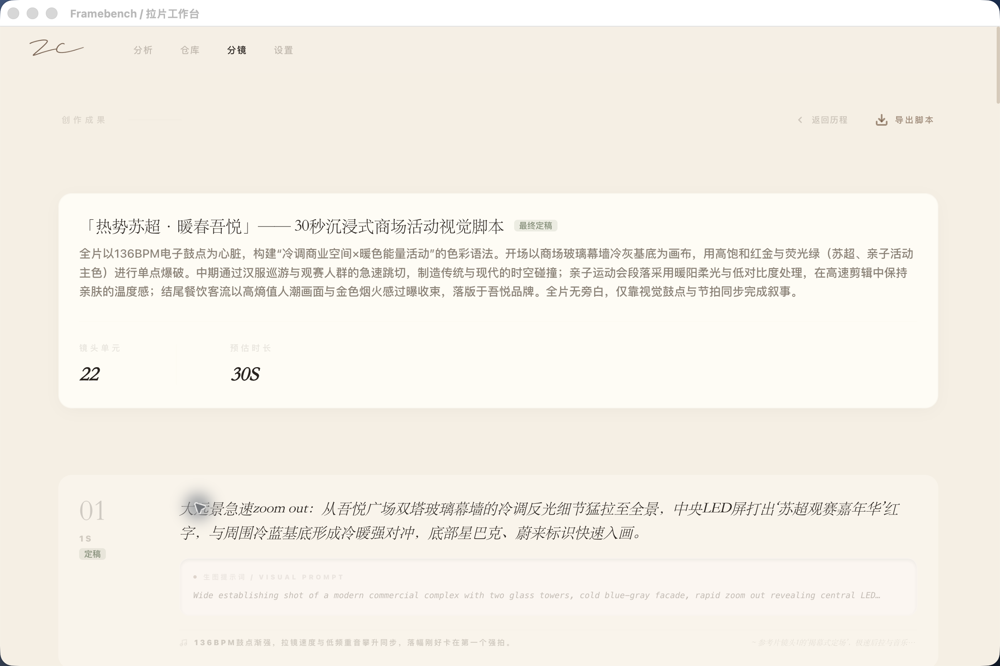
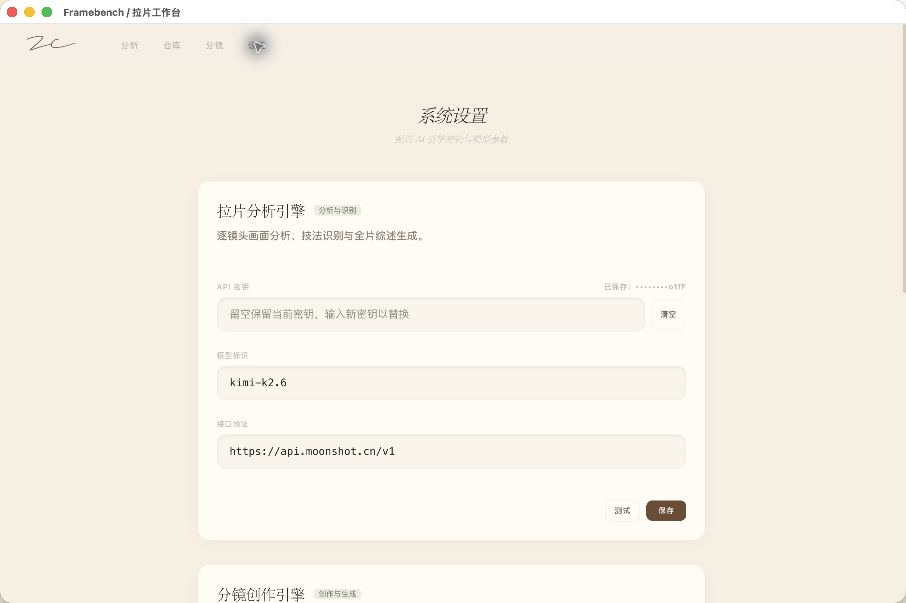

# Framebench / 拉片工作台

Framebench / 拉片工作台 is a small desktop workbench for film analysis, shot reference, and storyboard drafts.

It is built for creators who want to quickly upload a film clip, break it into shots, read an AI-assisted analysis report, keep a lightweight reference library, and turn selected references into storyboard prompts.

## Screenshots

### Analysis



### Report



### Library



### Storyboard


### Storyboard Script



### Settings



## Features

- Upload local video files and split them into shot-level analysis.
- Follow processing in a simple progress view.
- Read flexible Markdown reports without forcing a fixed report structure.
- Keep a lightweight reference library with optional categories.
- Generate storyboard drafts from selected reference videos.
- Edit model and API key settings inside the app.
- Package as a macOS desktop app with a bundled backend runtime.

## Tech Stack

- Frontend: React, TypeScript, Vite, Electron
- Backend: FastAPI, SQLite
- Runtime: local desktop app with a bundled Python backend

## Development

```bash
./start.sh
```

The dev script starts the FastAPI backend and Vite frontend together. New environment variables use the `FRAMEBENCH_*` prefix; legacy `FILM_MASTER_*` variables are still accepted for local compatibility.

Open the printed local URL in your browser, or run the packaged Electron app after building.

## Build

```bash
cd frontend
npm run electron:build
```

The packaged app stores user data under the existing compatible data root when previous Film Master / 拉片工作台 data is found, so older history and API keys remain available after the rename.

## Local Data

Framebench stores history, generated analysis files, and API settings locally on the user's machine. These files are not part of the source repository or installer bundle.

Typical macOS data locations:

- `~/Library/Application Support/Framebench`
- compatible legacy folders from earlier builds, when present

## License

MIT
